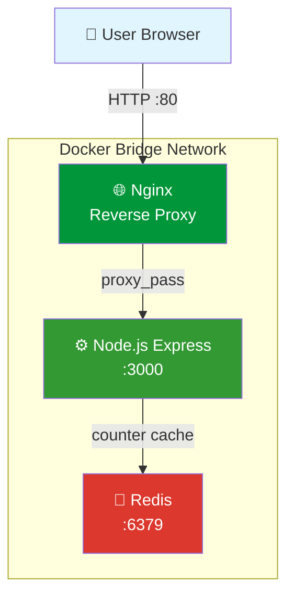
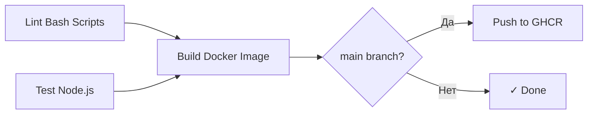

# 🚀 Node.js DevOps Portfolio Project


Полноценный учебный проект, демонстрирующий **полный цикл разработки и деплоя** (CI/CD) Node.js приложения с использованием современных DevOps-инструментов.

## 📋 Оглавление

- [О проекте](#-о-проекте)
- [Архитектура](#-архитектура)
- [Стек технологий](#-стек-технологий)
- [Быстрый старт](#-быстрый-старт)
- [Локальная разработка](#-локальная-разработка)
- [CI/CD Pipeline](#-cicd-pipeline)
- [API Эндпоинты](#-api-эндпоинты)
- [Структура проекта](#-структура-проекта)

---

## 🎯 О проекте

Этот проект создан как **практическое портфолио DevOps-инженера** и демонстрирует:

- ✅ Контейнеризацию приложения с best practices (multi-stage build, non-root user, healthchecks)
- ✅ Оркестрацию микросервисов через Docker Compose
- ✅ Настройку Nginx как reverse proxy в Docker-сети
- ✅ Автоматизацию CI/CD через GitHub Actions
- ✅ Публикацию Docker-образов в GitHub Container Registry (GHCR)
- ✅ Написание Bash-скриптов для автоматизации
- ✅ Работу с Git по Git Flow (ветки, Pull Requests, code review)

---

## 🏗 Архитектура



### Как это работает

1. **Пользователь** делает HTTP-запрос на `http://localhost:80`
2. **Nginx** (в Docker-контейнере) принимает запрос и проксирует его в Node.js приложение
3. **Node.js Express** обрабатывает запрос, при необходимости обращается к Redis
4. **Redis** хранит счётчик посещений и кэшированные данные
5. Ответ возвращается пользователю через Nginx

Все сервисы изолированы в собственных контейнерах и общаются через внутреннюю Docker-сеть.

---

## 🛠 Стек технологий

| Категория | Технология |
|-----------|-----------|
| **OS** | Ubuntu 24.04 LTS |
| **Scripting** | Bash |
| **VCS** | Git, GitHub |
| **Runtime** | Node.js 20, Express.js |
| **Database** | Redis 7 |
| **Web Server** | Nginx |
| **Containerization** | Docker, Docker Compose |
| **CI/CD** | GitHub Actions |
| **Registry** | GitHub Container Registry (GHCR) |
| **Testing** | Jest |
| **Linting** | ShellCheck |

---

## 🚀 Быстрый старт

### Вариант 1: Запуск через готовый Docker-образ из GHCR

**Самый быстрый способ** — использовать уже собранный образ из GitHub Container Registry:

```bash
# Запустить приложение одной командой
docker run -d \
  --name portfolio-app \
  -p 3000:3000 \
  ghcr.io/tohnoky/node-portfolio:latest

# Проверить, что работает
curl http://localhost:3000/healthz
# Ответ: OK

# Открыть в браузере
open http://localhost:3000
```

### Вариант 2: Полный стек через Docker Compose (рекомендуется)

```bash
# 1. Клонируйте репозиторий
git clone https://github.com/Tohnoky/node-portfolio.git
cd node-portfolio

# 2. Запустите весь стек (app + redis + nginx)
docker compose up -d

# 3. Проверьте статус
docker compose ps

# 4. Откройте в браузере
open http://localhost
```

---

## 💻 Локальная разработка

### Требования

- Ubuntu 24.04 LTS (или любая Linux-система)
- Docker и Docker Compose
- Node.js 20+
- Git

### Установка

```bash
# 1. Клонируйте репозиторий
git clone https://github.com/Tohnoky/node-portfolio.git
cd node-portfolio

# 2. Проверьте окружение
./scripts/setup.sh

# 3. Установите зависимости
cd app && npm install && cd ..

# 4. Запустите в режиме разработки
docker compose up -d
```

### Полезные команды

```bash
# Логи всех сервисов в реальном времени
docker compose logs -f

# Логи конкретного сервиса
docker compose logs -f app
docker compose logs -f redis
docker compose logs -f nginx

# Перезапустить всё
docker compose restart

# Остановить и удалить контейнеры
docker compose down

# Остановить и удалить вместе с данными Redis
docker compose down -v

# Пересобрать образы после изменений
docker compose build --no-cache
docker compose up -d
```

---

## ⚙️ CI/CD Pipeline

Проект использует **GitHub Actions** для автоматизации всех этапов разработки.

### Триггеры

Pipeline запускается автоматически при:
- 📥 Push в ветку `main`
- 🔀 Создании Pull Request в `main`

### Этапы Pipeline



| Stage | Описание | Инструменты |
|-------|----------|-------------|
| **Lint** | Проверка bash-скриптов на соответствие стандартам | ShellCheck |
| **Test** | Запуск unit-тестов приложения | Jest |
| **Build** | Сборка Docker-образа | Docker Buildx |
| **Push** | Публикация образа в GHCR (только для main) | GHCR |

### Локальная проверка перед коммитом

```bash
# Проверить bash-скрипты
shellcheck scripts/*.sh

# Запустить тесты
cd app && npm test && cd ..

# Собрать Docker-образ локально
docker build -t node-portfolio:test ./app
```

---

## 🔌 API Эндпоинты

| Метод | Путь | Описание | Ответ |
|-------|------|----------|-------|
| `GET` | `/` | Главная страница со счётчиком посещений | HTML |
| `GET` | `/healthz` | Healthcheck для Docker и CI/CD | `OK` (200) |
| `GET` | `/version` | Информация о версии приложения | JSON |
| `GET` | `/reset` | Сброс счётчика посещений | JSON |

### Примеры запросов

```bash
# Healthcheck
curl http://localhost/healthz
# OK

# Информация о версии
curl http://localhost/version
# {"version":"1.0.0-local","environment":"production","uptime":123.45,"redis":"connected"}

# Главная страница
curl http://localhost/
# HTML со счётчиком посещений
```

---

## 📂 Структура проекта

```
node-portfolio/
├── .github/
│   └── workflows/
│       └── ci.yml              # GitHub Actions CI/CD pipeline
├── app/                        # Node.js приложение
│   ├── tests/                  # Jest тесты
│   ├── .dockerignore
│   ├── Dockerfile              # Multi-stage Docker build
│   ├── index.js                # Главный файл приложения
│   ├── package.json
│   └── package-lock.json
├── deploy/
│   └── nginx/
│       └── portfolio.conf      # Конфиг Nginx (reverse proxy)
├── docs/                       # Документация
├── scripts/                    # Bash-скрипты автоматизации
│   ├── backup.sh               # Скрипт бэкапов
│   ├── healthcheck.sh          # Проверка здоровья сервисов
│   └── setup.sh                # Проверка окружения
├── .gitignore
├── docker-compose.yml          # Оркестрация всех сервисов
└── README.md
```

---

## 🔒 Безопасность

Проект следует лучшим практикам безопасности:

- ✅ **Non-root user** в Docker-контейнере (пользователь `nodejs`)
- ✅ **Healthchecks** для автоматического обнаружения проблем
- ✅ **Secrets management** через GitHub Secrets
- ✅ **Read-only конфиги** монтируются в контейнеры
- ✅ **Isolated networks** для Docker-сервисов
- ✅ **.dockerignore** исключает лишние файлы из образа
- ✅ **Минимальный базовый образ** (node:20-alpine)

---


## 🗺 Roadmap

- [x] Базовая настройка Ubuntu и Linux basics
- [x] Bash-скрипты автоматизации
- [x] Git workflow с Pull Requests
- [x] Node.js приложение с Express
- [x] Настройка Nginx как reverse proxy
- [x] Docker контейнеризация
- [x] Docker Compose оркестрация
- [x] CI/CD через GitHub Actions
- [x] Публикация в GitHub Container Registry
- [ ] Мониторинг через Prometheus + Grafana
- [ ] Infrastructure as Code (Terraform)
- [ ] Configuration Management (Ansible)
- [ ] Kubernetes deployment

---

## 🤝 Contributing

Pull requests приветствуются! Для крупных изменений сначала откройте Issue для обсуждения.

---

## 📝 License

MIT

---

## 👨‍💻 Автор

**Tohnoky** — DevOps Engineer Trainee

- GitHub: [@Tohnoky](https://github.com/Tohnoky)
- Project: [node-portfolio](https://github.com/Tohnoky/node-portfolio)

---

*Проект создан в обучающих целях для демонстрации DevOps-практик и инструментов.*
