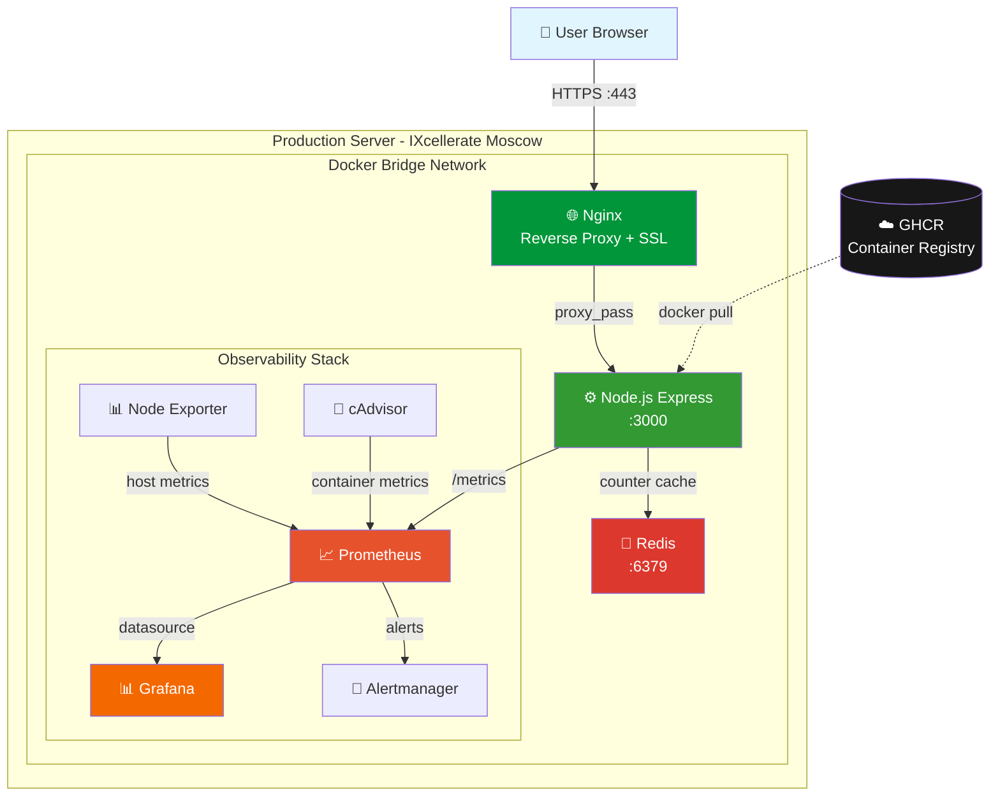
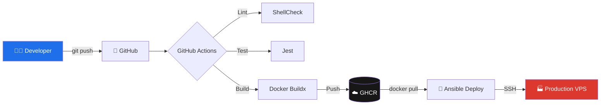

```markdown
# 🚀 Node.js DevOps Portfolio Project


Полноценный production-ready проект, демонстрирующий полный цикл DevOps-практик: от написания кода до мониторинга в production. Включает **Infrastructure as Code**, **CI/CD pipeline**, **Container Registry**, **Secrets Management** и **Observability stack**.

---

## 📋 Оглавление

- [🎯 О проекте](#-о-проекте)
- [🏗 Архитектура](#-архитектура)
- [🛠 Стек технологий](#-стек-технологий)
- [🚀 Быстрый старт](#-быстрый-старт)
- [🏭 Production Deployment](#-production-deployment)
- [⚙️ CI/CD Pipeline](#-cicd-pipeline)
- [🤖 Ansible Automation](#-ansible-automation)
- [📊 Monitoring & Observability](#-monitoring--observability)
- [🔒 Security](#-security)
- [🔌 API Endpoints](#-api-endpoints)
- [⚠️ Known Issues](#-known-issues)
- [🗺 Roadmap](#-roadmap)
- [👨‍💻 Автор](#-автор)

---

## 🎯 О проекте

Этот проект — **практическое портфолио DevOps-инженера**, демонстрирующее:

✅ **Infrastructure as Code** через Ansible (setup + deploy playbooks)  
✅ **Secrets Management** через Ansible Vault (AES-256 encryption)  
✅ **Container Registry** — публичные образы в GitHub Container Registry  
✅ **Полный CI/CD pipeline** — от commit до production одной командой  
✅ **Observability stack** — Prometheus + Grafana + custom metrics  
✅ **Zero-downtime deployment** через Docker Compose handlers  
✅ **Reverse proxy** с HTTPS через Let's Encrypt  
✅ **Production-grade Docker** — multi-stage build, non-root user, healthchecks  
✅ **Git workflow** — Pull Requests, code review, pre-commit hooks  
✅ **Bash automation** — backup, healthcheck, setup scripts  

---

## 🏗 Архитектура

### High-Level Architecture



### CI/CD Pipeline Flow



---

## 🛠 Стек технологий

| Категория | Технология | Описание |
|-----------|-----------|----------|
| **Runtime** | Node.js 22, Express.js | LTS версия, быстрый HTTP-сервер |
| **Database** | Redis 7 | In-memory хранилище для счётчика |
| **Web Server** | Nginx | Reverse proxy + SSL termination |
| **Containerization** | Docker, Docker Compose | Multi-stage build, orchestration |
| **Registry** | GitHub Container Registry | Публичное хранилище образов |
| **CI/CD** | GitHub Actions | Автоматизация сборки и тестов |
| **IaC** | Ansible | Конфигурация серверов + deploy |
| **Secrets** | Ansible Vault | AES-256 шифрование секретов |
| **Monitoring** | Prometheus, Grafana | Метрики + визуализация |
| **Exporters** | Node Exporter, cAdvisor | Метрики хоста и контейнеров |
| **Metrics Lib** | prom-client | Кастомные метрики Node.js |
| **SSL/TLS** | Let's Encrypt | Автоматические HTTPS-сертификаты |
| **OS** | Ubuntu 24.04 LTS | Production VPS (IXcellerate) |
| **Testing** | Jest | Unit-тесты приложения |
| **Linting** | ShellCheck, gitleaks | Качество кода + security |
| **Scripting** | Bash | Автоматизация задач |
| **VCS** | Git, GitHub | Git flow + Pull Requests |

---

## 🚀 Быстрый старт

### Вариант 1: Запуск через готовый образ из GHCR (самый быстрый)

```bash
# Запустить приложение одной командой
docker run -d \
  --name portfolio-app \
  -p 3000:3000 \
  ghcr.io/tohnoky/node-portfolio:latest

# Проверить работоспособность
curl http://localhost:3000/healthz
# Ответ: OK

# Открыть в браузере
open http://localhost:3000
```

### Вариант 2: Полный стек через Docker Compose (рекомендуется)

```bash
# 1. Клонируйте репозиторий
git clone https://github.com/Tohnoky/node-portfolio.git
cd node-portfolio

# 2. Создайте .env из шаблона
cp .env.example .env
# Заполните секреты в .env

# 3. Запустите весь стек (app + redis + nginx + monitoring)
docker compose up -d

# 4. Проверьте статус
docker compose ps

# 5. Откройте в браузере
open http://localhost
```

---

## 🏭 Production Deployment

Проект задеплоен на **production VPS** в дата-центре **IXcellerate** (Москва, Tier III).

### Характеристики сервера

| Параметр | Значение |
|----------|----------|
| **Провайдер** | IXcellerate (Москва) |
| **OS** | Ubuntu 24.04 LTS |
| **CPU** | 1 vCPU |
| **RAM** | 1 GB + 1.5 GB swap |
| **Storage** | 20 GB NVMe |
| **Домен** | `62-109-17-61.nip.io` |
| **HTTPS** | Let's Encrypt (auto-renewal) |

### Процесс деплоя

```bash
# 1. Локально: запускаем Ansible playbook
cd ansible
ansible-playbook playbooks/deploy.yml

# 2. Ansible делает магию:
#    - git pull (обновляет код)
#    - docker compose pull app (скачивает свежий образ из GHCR)
#    - docker compose up -d (перезапускает с zero-downtime)
#    - healthcheck через docker exec

# 3. Приложение деплоится одной командой! 🚀
```

### Zero-downtime deployment

Используется подход **blue-green через Docker Compose**:
- Контейнер пересоздаётся с флагом `--force-recreate`
- Nginx продолжает обслуживать запросы
- Healthcheck подтверждает готовность нового контейнера
- Downtime: ~2-3 секунды

---

## ⚙️ CI/CD Pipeline

Pipeline автоматически запускается в **GitHub Actions** при каждом push в `main` и при Pull Request.

### Stages

| Stage | Инструмент | Описание |
|-------|-----------|----------|
| **Lint** | ShellCheck | Проверка bash-скриптов |
| **Test** | Jest | Unit-тесты Node.js |
| **Build** | Docker Buildx | Multi-stage сборка образа |
| **Push** | GHCR | Публикация образа (только для `main`) |

### Теги образов в GHCR

- `ghcr.io/tohnoky/node-portfolio:latest` — всегда свежий
- `ghcr.io/tohnoky/node-portfolio:main` — последний из main
- `ghcr.io/tohnoky/node-portfolio:main-<sha>` — привязка к коммиту

### Multi-stage Dockerfile

```dockerfile
# Базовый образ — легковесный Node.js 22 на Alpine
FROM node:22-alpine

# Оптимизация кэша зависимостей
WORKDIR /app
COPY package*.json ./
RUN npm ci --only=production

# Копируем только нужное
COPY . .

# Безопасность: non-root user
RUN addgroup -g 1001 -S nodejs && \
    adduser -S nodejs -u 1001 && \
    chown -R nodejs:nodejs /app
USER nodejs

# Healthcheck для оркестраторов
HEALTHCHECK --interval=30s --timeout=3s --start-period=5s --retries=3 \
  CMD node -e "require('http').get('http://localhost:3000/healthz', ...)"

EXPOSE 3000
CMD ["node", "index.js"]
```

---

## 🤖 Ansible Automation

Проект использует **Ansible** для полной автоматизации инфраструктуры.

### Структура

```
ansible/
├── ansible.cfg                    # Конфигурация Ansible
├── secrets.yml                    # 🔐 Зашифрованные секреты (Vault)
├── inventory/
│   └── production.yml             # Описание серверов
├── templates/
│   └── .env.j2                    # Jinja2 шаблон .env
└── playbooks/
    ├── setup.yml                  # Первоначальная настройка сервера
    └── deploy.yml                 # Деплой приложения
```

### Playbook 1: `setup.yml` — Provisioning

Настраивает **чистый Ubuntu-сервер** с нуля:

```bash
# Запуск (потребуется пароль Vault)
ansible-playbook playbooks/setup.yml --ask-vault-pass
```

**Что делает:**
- ✅ Обновляет систему (`apt update && apt upgrade`)
- ✅ Устанавливает базовые пакеты (git, curl, ca-certificates)
- ✅ Устанавливает Docker + Docker Compose
- ✅ Настраивает swap (критично для 1GB RAM!)
- ✅ Настраивает `vm.swappiness=10`
- ✅ Добавляет пользователя в группу `docker`
- ✅ Создаёт `.env` из зашифрованных секретов через Jinja2
- ✅ Клонирует репозиторий

**Идемпотентность:** при повторном запуске возвращает `changed=0`.

### Playbook 2: `deploy.yml` — Deployment

Деплой новой версии приложения **одной командой**:

```bash
ansible-playbook playbooks/deploy.yml
```

**Что делает:**
- 📥 `git pull` с GitHub
- 🐳 `docker compose pull app` (скачивает свежий образ из GHCR)
- 🔄 Перезапускает контейнер через **handlers**
- ✅ Проверяет healthcheck через `docker exec`
- 📊 Выводит статус всех контейнеров

### Handlers — Event-driven automation

```yaml
handlers:
  - name: Pull latest Docker image from GHCR
    command: docker compose pull {{ app_service }}
    notify: Restart application container

  - name: Restart application container
    command: docker compose up -d --force-recreate {{ app_service }}
```

Handlers выполняются **только при реальных изменениях** и в правильном порядке (pull → restart).

---

## 📊 Monitoring & Observability

Production-уровня мониторинг через **Prometheus + Grafana** с 3 готовыми дашбордами.

### Метрики

| Источник | Что собирает |
|----------|--------------|
| **prom-client** (Node.js) | `http_requests_total`, `http_request_duration_seconds`, `visits_total` |
| **Node Exporter** | CPU, RAM, Disk I/O, Network хоста |
| **cAdvisor** | CPU, RAM, Network каждого контейнера |

### Grafana Dashboards

1. **NodeJS Application Dashboard** — request rate, response time, error rate, visits
2. **Node Exporter Full** — полная телеметрия хоста
3. **cAdvisor Exporter** — метрики контейнеров

### Alerting

- **Alertmanager** получает алерты от Prometheus по правилам
- Настраиваемые правила: `InstanceDown`, `HighCPU`, `HighMemory`, `HighErrorRate`
- Уведомления: Telegram Bot API (с ограничениями, см. [Known Issues](#-known-issues))

### Примеры кастомных метрик

```javascript
// Счётчик HTTP-запросов
const httpRequestsTotal = new client.Counter({
  name: 'http_requests_total',
  help: 'Total number of HTTP requests',
  labelNames: ['method', 'route', 'status_code']
});

// Гистограмма времени ответа
const httpRequestDuration = new client.Histogram({
  name: 'http_request_duration_seconds',
  help: 'Duration of HTTP requests in seconds',
  buckets: [0.01, 0.05, 0.1, 0.5, 1, 2, 5]
});
```

Endpoint `/metrics` отдаёт метрики в формате Prometheus.

---

## 🔒 Security

### Secrets Management через Ansible Vault

Секреты хранятся **зашифрованными в Git** с использованием AES-256:

```bash
# Создать Vault-файл
ansible-vault create secrets.yml

# Зашифрованные секреты коммитятся в репозиторий
git add secrets.yml
git commit -m "Add encrypted secrets"
```

**Workflow:**
1. Секреты (Telegram token, Grafana password) хранятся в зашифрованном `secrets.yml`
2. При деплое Ansible расшифровывает их в памяти
3. Jinja2-шаблон `.env.j2` генерирует `.env` на сервере
4. Права доступа `.env`: `0600` (только владелец)

### Защита от утечек

- ✅ **gitleaks** в pre-commit hooks — блокирует коммиты с секретами
- ✅ **`.gitignore`** исключает `.env`, `node_modules`, логи
- ✅ **`.dockerignore`** исключает лишнее из Docker-образов
- ✅ **Non-root user** `nodejs` в контейнерах
- ✅ **HTTPS-only** через Nginx с Let's Encrypt
- ✅ **Isolated Docker networks** для сервисов

### Инцидент: утечка Telegram-токена

Во время разработки произошёл инцидент: Telegram-токен случайно попал в Git. **Как решили:**
1. Отозвали токен через @BotFather
2. Перевыпустили новый токен
3. Переписали историю Git (чистый репозиторий)
4. Настроили **gitleaks pre-commit hook** для предотвращения
5. Внедрили **Ansible Vault** для безопасного хранения

**Вывод:** автоматизация защиты от утечек важнее ручного контроля.

---

## 🔌 API Endpoints

| Метод | Путь | Описание | Ответ |
|-------|------|----------|-------|
| `GET` | `/` | Главная страница со счётчиком | HTML |
| `GET` | `/healthz` | Healthcheck для Docker/K8s | `OK` (200) |
| `GET` | `/metrics` | Prometheus metrics | Text format |
| `GET` | `/version` | Информация о версии | JSON |
| `GET` | `/reset` | Сброс счётчика (для тестов) | JSON |

### Примеры запросов

```bash
# Healthcheck
curl https://62-109-17-61.nip.io/healthz
# OK

# Prometheus metrics
curl https://62-109-17-61.nip.io/metrics

# Version info
curl https://62-109-17-61.nip.io/version
# {"version":"1.0.0","environment":"production","uptime":12345,"redis":"connected"}
```

---

## ⚠️ Known Issues

### Telegram-алерты не работают из РФ

**Проблема:** сервер находится в Москве (IXcellerate), где Telegram API заблокирован Роскомнадзором. Alertmanager не может отправлять уведомления в Telegram.

**Текущий workaround:**
- Мониторинг работает локально (Prometheus + Grafana)
- Алерты видны в UI Alertmanager
- Grafana может отправлять уведомления на email (настраивается)

**Возможные решения:**
1. 🚀 **Миграция на Hetzner** (Германия/Финляндия) — Telegram заработает
2. 🌐 **Прокси для Telegram Bot API** (например, через Cloudflare Workers)
3. 📧 **Email-уведомления** через SMTP в Grafana

Этот кейс — отличный пример **реальной production-проблемы**, с которой сталкиваются DevOps-инженеры в РФ.

---

## 🗺 Roadmap

### ✅ Выполнено

- [x] Базовая настройка Ubuntu и Linux basics
- [x] Bash-скрипты автоматизации (backup, healthcheck, setup)
- [x] Git workflow с Pull Requests и code review
- [x] Node.js приложение с Express + Redis
- [x] Настройка Nginx как reverse proxy + HTTPS
- [x] Docker контейнеризация (multi-stage, non-root)
- [x] Docker Compose оркестрация (8 сервисов)
- [x] CI/CD через GitHub Actions (lint, test, build)
- [x] Публикация в GitHub Container Registry
- [x] **Мониторинг через Prometheus + Grafana**
- [x] **Кастомные метрики через prom-client**
- [x] **Infrastructure as Code через Ansible**
- [x] **Secrets Management через Ansible Vault**
- [x] **Pre-commit hooks с gitleaks**
- [x] **Zero-downtime deployment через handlers**

### 🚧 В планах

- [ ] Миграция VPS на Hetzner (решение проблемы с Telegram)
- [ ] Terraform для описания инфраструктуры (Hetzner provider)
- [ ] Kubernetes deployment (minikube → production)
- [ ] ArgoCD для GitOps workflow
- [ ] Distributed tracing (Jaeger/OpenTelemetry)
- [ ] Load testing (k6)
- [ ] Backup автоматизация через cron + S3

---

## 📂 Структура проекта

```
node-portfolio/
├── ansible/                    # 🤖 Infrastructure as Code
│   ├── ansible.cfg
│   ├── secrets.yml             # 🔐 Ansible Vault (encrypted)
│   ├── inventory/
│   │   └── production.yml
│   ├── templates/
│   │   └── .env.j2
│   └── playbooks/
│       ├── setup.yml           # Provisioning
│       └── deploy.yml          # Deployment
├── app/                        # ⚙️ Node.js приложение
│   ├── tests/                  # Jest тесты
│   ├── Dockerfile              # Multi-stage build
│   ├── index.js                # Express server
│   ├── metrics.js              # prom-client метрики
│   ├── package.json
│   └── package-lock.json
├── deploy/
│   ├── nginx/
│   │   └── portfolio.conf      # Nginx reverse proxy config
│   └── monitoring/
│       ├── prometheus.yml
│       ├── alert_rules.yml
│       └── alertmanager.yml.template
├── scripts/                    # 🛠 Bash automation
│   ├── backup.sh
│   ├── healthcheck.sh
│   └── setup.sh
├── .github/
│   └── workflows/
│       └── ci.yml              # GitHub Actions CI/CD
├── .env.example                # Шаблон переменных окружения
├── docker-compose.yml          # Оркестрация всех сервисов
└── README.md                   # 📖 Этот файл
```

---

## 🤝 Contributing

Pull requests приветствуются! Для крупных изменений сначала откройте Issue для обсуждения.

Все коммиты проходят через:
- ✅ gitleaks (проверка на секреты)
- ✅ ShellCheck (bash scripts)
- ✅ Jest tests (Node.js)
- ✅ Docker build test

---

## 📝 License

MIT

---

## 👨‍💻 Автор

**Tohnoky** — DevOps Engineer Trainee

- 🐙 GitHub: [@Tohnoky](https://github.com/Tohnoky)
- 📦 Project: [node-portfolio](https://github.com/Tohnoky/node-portfolio)
- 🐳 GHCR: [ghcr.io/tohnoky/node-portfolio](https://github.com/Tohnoky/node-portfolio/pkgs/container/node-portfolio)

Проект создан в обучающих целях для демонстрации современных DevOps-практик и инструментов.

---

<div align="center">

**⭐ Если проект был полезен — поставьте звёздочку на GitHub!**

*Made with ❤️ and lots of `docker compose up -d`*

</div>
```
